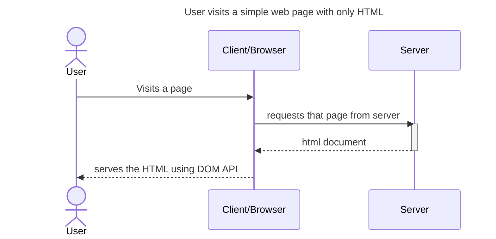

```mermaid
---
title: User visits a simple web page with only HTML
---
    sequenceDiagram
    actor u as User
    participant c as Client/Browser
    participant s as Server
    u->>c:  Visits a page
    c->>s: requests that page from server
    activate s
    s-->>c: html document
    deactivate s
    c-->>u: serves the HTML using DOM API
```