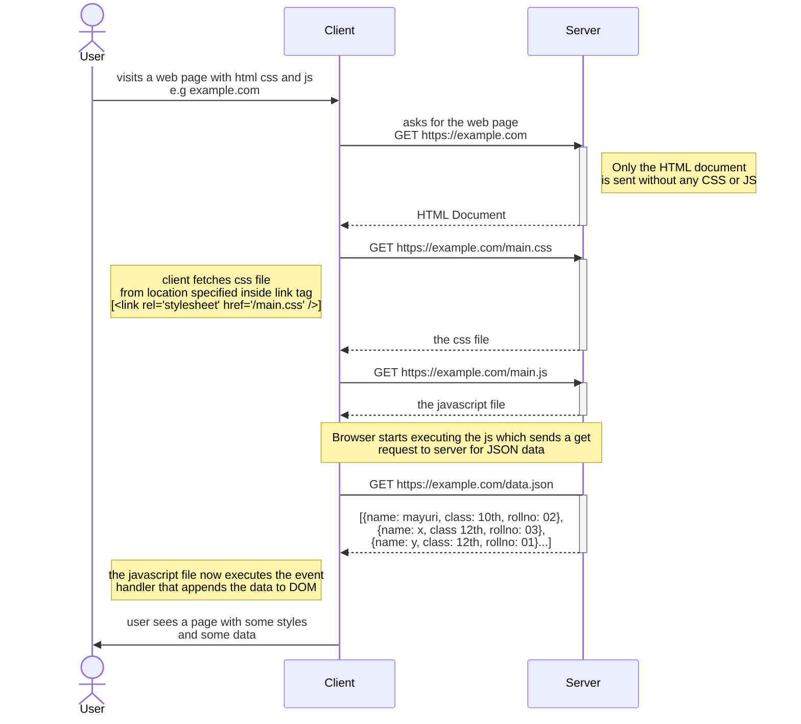

```mermaid
    sequenceDiagram
        actor u as User
        participant c as Client
        participant s as Server
        u->>c: visits a web page with html css and js<br/>e.g example.com
        c->>s: asks for the web page<br/>GET https://example.com
        activate s
        Note right of s: Only the HTML document<br/> is sent without any CSS or JS
        s-->>c: HTML Document
        deactivate s
        c->>s: GET https://example.com/main.css
        activate s
        Note left of c: client fetches css file<br/> from location specified inside link tag<br/>[<link rel="stylesheet" href="/main.css" />]
        s-->>c: the css file
        deactivate s
        c->>s: GET https://example.com/main.js
        activate s
        s-->>c: the javascript file
        deactivate s
        Note over c,s: Browser starts executing the js which sends a get<br/> request to server for JSON data
        c->s: GET https://example.com/data.json
        activate s
        s-->>c: [{name: mayuri, class: 10th, rollno: 02}, <br/>{name: x, class 12th, rollno: 03},<br/> {name: y, class: 12th, rollno: 01}...]
        deactivate s
        Note left of c: the javascript file now executes the event<br/> handler that appends the data to DOM
        c->>u: user sees a page with some styles<br/>and some data
```