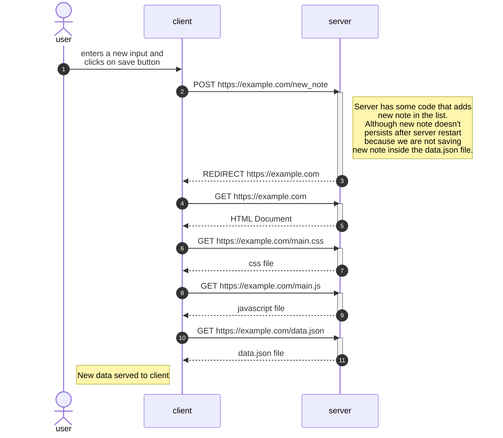

## Forms and http post request
Here we're dealing with a webpage that is made up of pure html, css and js. Any changes are handled using event handlers. Here a user can input something and manipulate the DOM. This is the code: 
```
title: index.html

<!DOCTYPE html>
<html>
<head>
  <link rel="stylesheet" type="text/css" href="/exampleapp/main.css" />
  <script type="text/javascript" src="/exampleapp/main.js"></script>
</head>
<body>
  <div class='container'>
    <h1>Notes</h1>
    <div id='notes'>
    </div>
    <form action='/new_note' method='POST'>
      <input type="text" name="note"><br>
      <input type="submit" value="Save">
    </form>
  </div>
</body>
</html>
```

```
title: main.js

var xhttp = new XMLHttpRequest()
xhttp.onreadystatechange = function () {
  if (this.readyState == 4 && this.status == 200) {
    const data = JSON.parse(this.responseText)
    console.log(data)

    var ul = document.createElement('ul')
    ul.setAttribute('class', 'notes')

    data.forEach(function(note){
      var li = document.createElement('li')
      
      ul.appendChild(li);
      li.appendChild(document.createTextNode(note.content))
    })

    document.getElementById("notes").appendChild(ul)
  }
}

xhttp.open("GET", "/exampleapp/data.json", true)
xhttp.send()
```

