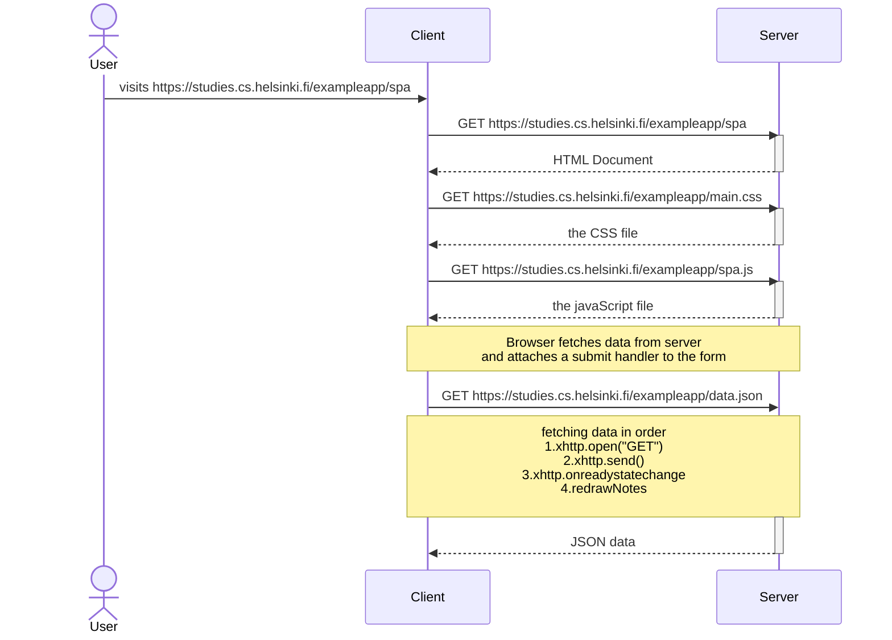

```mermaid
    sequenceDiagram
    actor u as User
    participant c as Client
    participant s as Server
    u->>c: visits https://studies.cs.helsinki.fi/exampleapp/spa
    c->>s: GET https://studies.cs.helsinki.fi/exampleapp/spa
    activate s
    s-->>c: HTML Document
    deactivate s
    c->>s: GET https://studies.cs.helsinki.fi/exampleapp/main.css
    activate s
    s-->>c: the CSS file
    deactivate s
    c->>s: GET https://studies.cs.helsinki.fi/exampleapp/spa.js
    activate s
    s-->>c: the javaScript file
    deactivate s
    Note over c, s: Browser fetches data from server <br/> and attaches a submit handler to the form
    c->>s: GET https://studies.cs.helsinki.fi/exampleapp/data.json
    Note over c, s: fetching data in order<br/>1.xhttp.open("GET")<br/>2.xhttp.send()<br/>3.xhttp.onreadystatechange<br/>4.redrawNotes<br/>
    activate s
    s-->>c: JSON data
    deactivate s
```