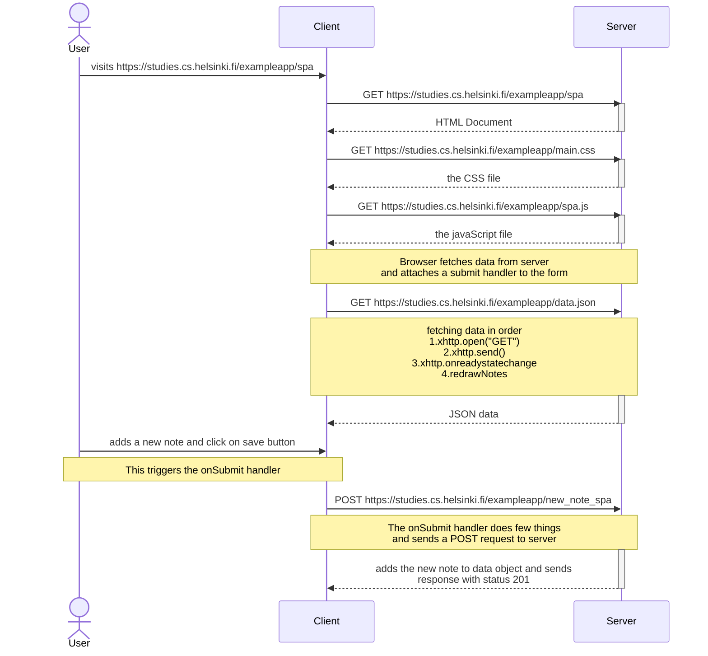

## Single Page Application
***Single page applications are websites/web applications that dynamically change on some user interaction rather than refreshing(refetching the data from server) or redirecting to some other page.
<br/>
In a SPA, a page refresh never occurs; instead, all necessary HTML, JavaScript, and CSS code is either retrieved by the browser with a single page load, or the appropriate resources are dynamically loaded and added to the page as necessary, usually in response to user actions.***

### Manipulating the data without any redirects
We're trying to add the new note without defining any form method inside the HTML. We don't want to send a redirect response on POST request to server for adding a new note instead, we want to dynamically change the notes displayed without refetching the home page(which further leads to refetching of css file, js file and data)

```
title: index.html of https://studies.cs.helsinki.fi/exampleapp/spa
<!DOCTYPE html>
<html>
<head>
  <link rel="stylesheet" type="text/css" href="/exampleapp/main.css" />
  <script type="text/javascript" src="/exampleapp/spa.js"></script>
</head>
<body>
  <div class='container'>
    <h1>Notes -- single page app</h1>
    <div id='notes'>
    </div>
    <form id='notes_form'>
      <input type="text" name="note"><br>
      <input type="submit" value="Save">
    </form>
  </div>
</body>
</html>

```

```
title: spa.js
var notes = []

var redrawNotes = function() {
  var ul = document.createElement('ul')
  ul.setAttribute('class', 'notes')

  notes.forEach(function (note) {
    var li = document.createElement('li')

    ul.appendChild(li);
    li.appendChild(document.createTextNode(note.content))
  })

  var notesElement = document.getElementById("notes")
  if (notesElement.hasChildNodes()) {
    notesElement.removeChild(notesElement.childNodes[0]);
  }
  notesElement.appendChild(ul)
}

var xhttp = new XMLHttpRequest()

xhttp.onreadystatechange = function () {
  if (this.readyState == 4 && this.status == 200) {
    notes = JSON.parse(this.responseText)
    redrawNotes()
  }
}

xhttp.open("GET", "/exampleapp/data.json", true)
xhttp.send()

var sendToServer = function (note) {
  var xhttpForPost = new XMLHttpRequest()
  xhttpForPost.onreadystatechange = function () {
    if (this.readyState == 4 && this.status == 201) {
      console.log(this.responseText)
    }
  }

  xhttpForPost.open("POST", '/exampleapp/new_note_spa', true)
  xhttpForPost.setRequestHeader("Content-type", "application/json")
  xhttpForPost.send(JSON.stringify(note));
}

window.onload = function (e) {
  var form = document.getElementById("notes_form")
  form.onsubmit = function (e) {
    e.preventDefault()

    var note = {
      content: e.target.elements[0].value,
      date: new Date()
    }

    notes.push(note)
    e.target.elements[0].value = ""
    redrawNotes()
    sendToServer(note)
  }
}

```


